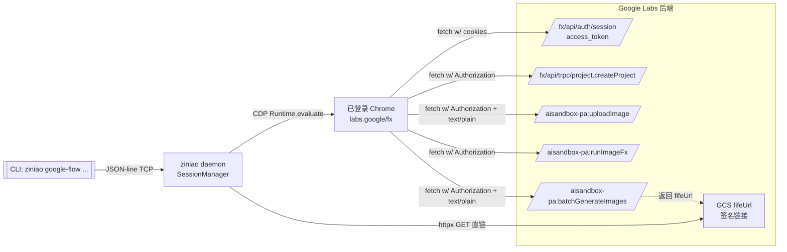

# google-flow — Google Labs / Flow 图像生成方案

本目录是 [ziniao](https://github.com/tianyehedashu/ziniao-mcp) 官方 site 预设，封装 [Google Flow](https://labs.google/flow/about) / Labs fx 工具链的**图像生成**能力，通过已登录 Chrome 的 Cookie 直调后端 REST / tRPC，不依赖 UI 自动化。

> 面向 AI agent 的操作指南请看 [`skills/google-flow-images/SKILL.md`](skills/google-flow-images/SKILL.md)。本文档是**技术方案 / 架构沉淀**，给人看。

---

## TL;DR

- **三条路径**：文生图（`runImageFx`） / 参考图生成（`batchGenerateImages`） / 媒体抓取（tRPC `media.fetchMedia`）。
- **默认模型**：参考图默认 `NARWHAL`（Nano Banana Pro），质量优先；文生图默认 `IMAGEN_3_5`（Imagen 4）。
- **图片落盘**：优先用 `--save-images PREFIX`（内含 base64 decode + fifeUrl HTTP 下载 + magic bytes 扩展名识别）。
- **全链路 API**：无 UI 自动化步骤，Slate.js / React portal 全避开。

```bash
# 文生图
uv run ziniao google-flow imagen-generate -V prompt="A koi lantern" --save-images exports/koi

# 参考图生成（默认 Pro）
uv run ziniao google-flow imagen-ref-generate -V images="./a.png,./b.png" -V prompt="ink painting" -V count=2 --save-images exports/out
```

---

## 预设清单

| 文件 | 子命令 | 端点 | 模式 | 用途 |
|------|-------|------|------|------|
| `auth-session.json` | `google-flow auth-session` | `labs.google/fx/api/auth/session` | fetch | 取 `access_token`（调试用） |
| `imagen-generate.json` | `google-flow imagen-generate` | `aisandbox-pa:v1:runImageFx` | js | 文生图（Imagen 4） |
| `imagen-ref-generate.json` | `google-flow imagen-ref-generate` | `aisandbox-pa:v1/projects/{pid}/flowMedia:batchGenerateImages` | js | 参考图生成（Nano Banana 2 / Pro） |
| `imagen-upload.json` | `google-flow imagen-upload` | `aisandbox-pa:v1/flow/uploadImage` | js | 单独上传参考图（返回 mediaId） |
| `media-fetch.json` | `google-flow media-fetch` | `labs.google/fx/api/trpc/media.fetchMedia` | fetch | 按 mediaKey 取历史资源 |

---

## 架构



端到端七步（参考图路径，preset 脚本自动串）：

1. **Session**：`GET /fx/api/auth/session` → `access_token`（页面 Cookie 换 Bearer）。
2. **Project**：若未传 `project_id`，`POST /fx/api/trpc/project.createProject` → 拿到新 `projectId`。
3. **Upload**：每张参考图 `POST /v1/flow/uploadImage { imageBytes: base64 }` → 返回 `media.name` (mediaId)。
4. **reCAPTCHA**：页面上下文内 `grecaptcha.enterprise.execute(SITE_KEY, {action:'IMAGE_GENERATION'})` → token。
5. **Generate**：`POST /v1/projects/{pid}/flowMedia:batchGenerateImages`，`requests[]` 长度 = `count`，每个 item 含全部 `imageInputs` + 不同 seed。
6. **Parse**：返回 `media[].image.generatedImage.fifeUrl`（GCS 签名 URL，有效 ~6h）。
7. **Download**：daemon 侧 `httpx.get(fifeUrl)` 写入 `PREFIX-i.{jpg|png|webp}`（按 magic bytes 识别）。

---

## 关键技术决策

### 1. 为什么完全走 API 而非 UI 自动化？

早期尝试过 Slate.js 编辑器输入 + 媒体选择器点击 + 生成按钮触发，问题：

- Slate 不认 `execCommand('insertText')` 也不认 `dispatch_key_event('char')`（后者虽然已通过 CDP `Input.insertText` 绕过，但仍不稳定）。
- 生成按钮点击后页面频繁 reset，看不到结果。
- UI 异步状态难以 observable；等不到"完成"的 locator。

走 API 后：

- 确定性：返回码即真相。
- 速度：少一次页面重渲染。
- 可扩展：多 ref / 多 count / seed 精准控制只是参数。

> 保留的 UI 工具：`ziniao insert-text`（CDP `Input.insertText`）仍是 Slate.js 通用方案，不再用于本站。

### 2. `Content-Type: text/plain;charset=UTF-8` 绕 CORS preflight

`aisandbox-pa.googleapis.com` 域名跨源，若用 `application/json` 会触发 OPTIONS preflight，后端不给 `Access-Control-Allow-Headers: content-type` → 浏览器拒绝。

解法：Body 仍是 JSON 文本，但 Content-Type 声明为 `text/plain;charset=UTF-8`。这是 [CORS "simple request" 豁免](https://developer.mozilla.org/en-US/docs/Web/HTTP/CORS#simple_requests) 里允许的 MIME 三件套（`text/plain` / `application/x-www-form-urlencoded` / `multipart/form-data`）之一。服务端照样以 JSON 解析。

同类技巧适用：`uploadImage` / `batchGenerateImages` 都这么做；`runImageFx` / tRPC 同源，不需要。

### 3. reCAPTCHA Enterprise 的两个魔术常量

```
SITE_KEY = 6LdsFiUsAAAAAIjVDZcuLhaHiDn5nnHVXVRQGeMV
ACTION   = IMAGE_GENERATION
```

通过 DevTools Runtime console 查 `grecaptcha.enterprise` 拿到 site key；action 值从 webpack bundle 里 grep `IMAGE_GENERATION` 定位（曾踩过 `action:'generate'` 得 403 `reCAPTCHA evaluation failed`）。

### 4. 项目 (`projectId`) 必须显式持有

`batchGenerateImages` 路径里必须带 `/projects/{pid}`；`uploadImage` 不会返回 projectId。首次调用如果用户没传 `-V project_id=`，preset 会静默调 tRPC `project.createProject` 新建一个，复用传参可跨次复用（会在 Flow UI 的项目列表里看到）。

### 5. 多参考图 × 多张生成矩阵

```
1 request  ⇒  1 image output
imageInputs[] 长度无限制（≥1），每个都作为条件同时输入同一 request
```

想出 N 张就在 `requests[]` 里放 N 个 item（每个完整配置相同，仅 seed 不同）。
**注意**：API 实测拒绝 `candidatesCount` 字段（返回 `Unknown name "candidatesCount"`）。

### 6. 配额按模型独立

`PUBLIC_ERROR_PER_MODEL_DAILY_QUOTA_REACHED`（429）是 `(account, model, UTC-date)` 三元组维度；跨模型 / 跨端点 / 跨账号都是独立池。见 [SKILL.md 模型矩阵](skills/google-flow-images/SKILL.md#模型与配额)。

---

## 文件布局

```
google-flow/
├── README.md                    # ← 本文件（技术方案）
├── auth-session.json            # 预设：会话令牌
├── imagen-generate.json         # 预设：文生图 runImageFx
├── imagen-ref-generate.json     # 预设：参考图 batchGenerateImages
├── imagen-upload.json           # 预设：上传参考图
├── media-fetch.json             # 预设：按 mediaKey 取历史
└── skills/
    └── google-flow-images/
        └── SKILL.md             # AI agent 操作手册（`ziniao skill install`）
```

---

## 扩展路线（未验证，欢迎 PR）

- **视频生成**：`flowMedia:batchGenerateVideos` / Veo 3 模型枚举（`VEO_*`）仍需抓包验证字段名。
- **编辑模式**：`IMAGE_INPUT_TYPE_BASE_IMAGE` 用于"在原图上改"场景（与 `REFERENCE` 语义不同）。
- **Style ref / Subject ref**：当前 CLI 默认都用 `REFERENCE`；UI 里 ingredient 是否有显式 style/subject 区分值得抓包。
- **Imagen 4 Fast**：webpack 里见过 `IMAGEN_3_5_FAST` 字样，未实证，暂不写入预设。

> 扩展方法见站点开发 SKILL 中的 [*Reversing Next.js / RSC Apps — Quick Checklist*](../skills/site-development/SKILL.md#reversing-nextjs--rsc-apps--quick-checklist)（HAR → 定位 tRPC/REST → CORS 绕过 → webpack 常量提取）。

---

## 合规

遵守 [Google 条款](https://policies.google.com/terms)；生成图输出通常含 SynthID 隐形水印。
